## 📱 Demo de la aplicación

<table align="center">
  <tr>
    <td align="center">
      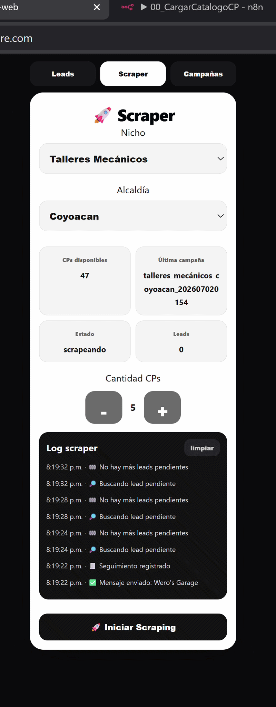 
      <b>Crear campaña</b>
    </td>
    <td width="30"></td>
    <td align="center">
      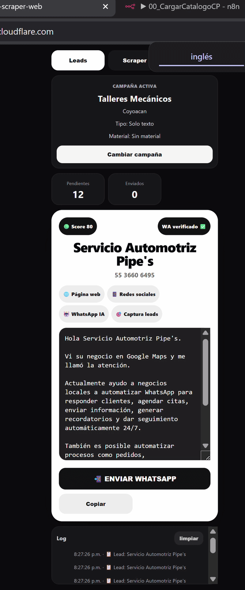 
      <b>Dashboard en tiempo real</b>
    </td>
  </tr>
</table>

# Prospector-Scraper

## Vista general de workflows

  <a href="docs/1.jpg">
    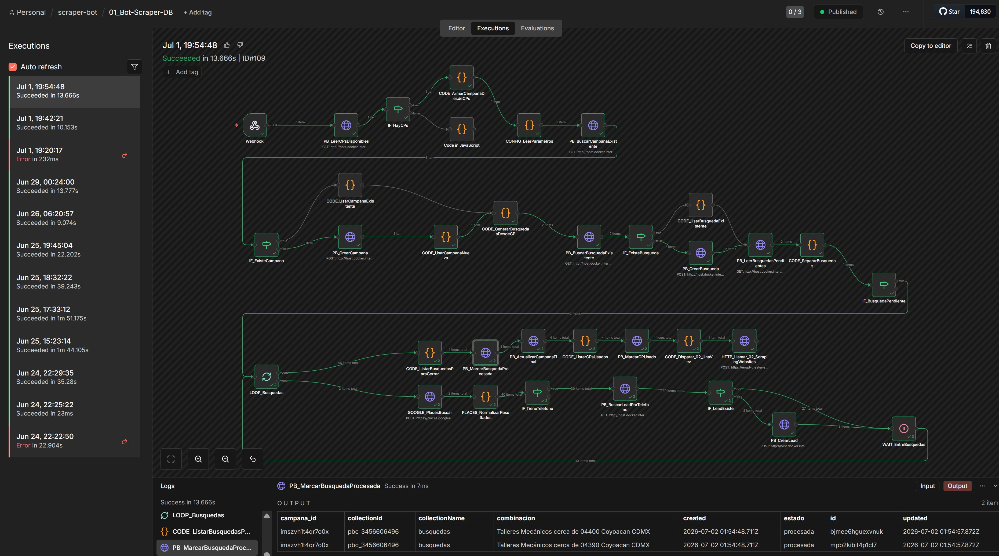
  </a>
  <a href="docs/2.jpg">
    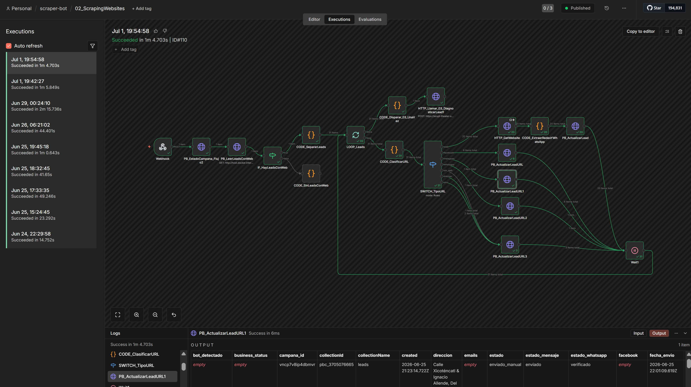
  </a>

  <a href="docs/3.jpg">
    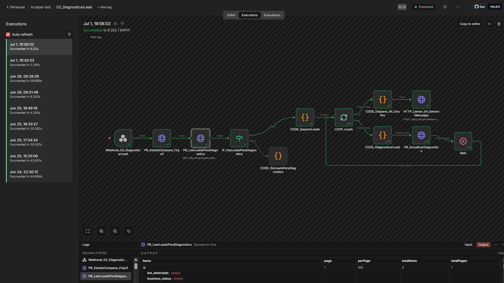
  </a>
  <a href="docs/4.jpg">
    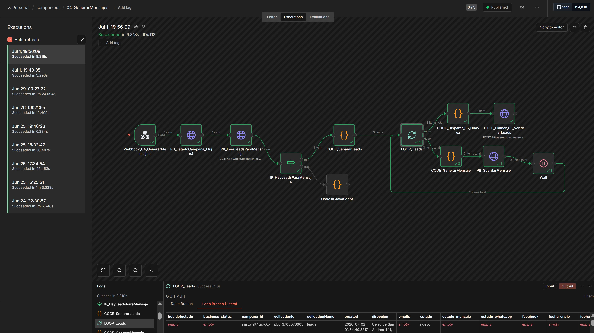
  </a>

  <a href="docs/5.jpg">
    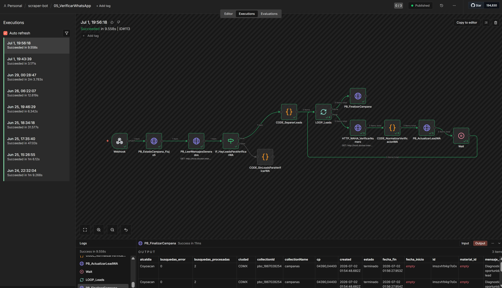
  </a>
  <a href="docs/6.jpg">
    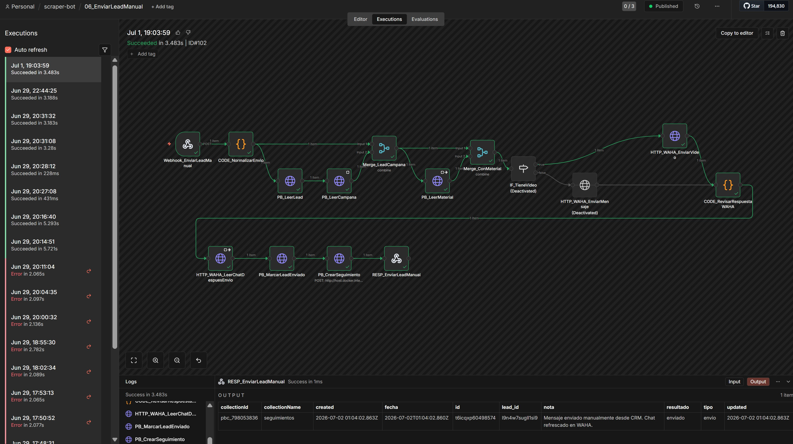
  </a>

---

## Flujo General

## Flujo General

1. Usuario crea campaña
2. Se generan lotes de códigos postales
3. Scraper obtiene negocios
4. Se extraen teléfonos
5. Se detecta WhatsApp
6. Se generan mensajes personalizados
7. Se envían mensajes
8. Se registran respuestas
9. Agente IA continúa conversación
10. Dashboard muestra métricas

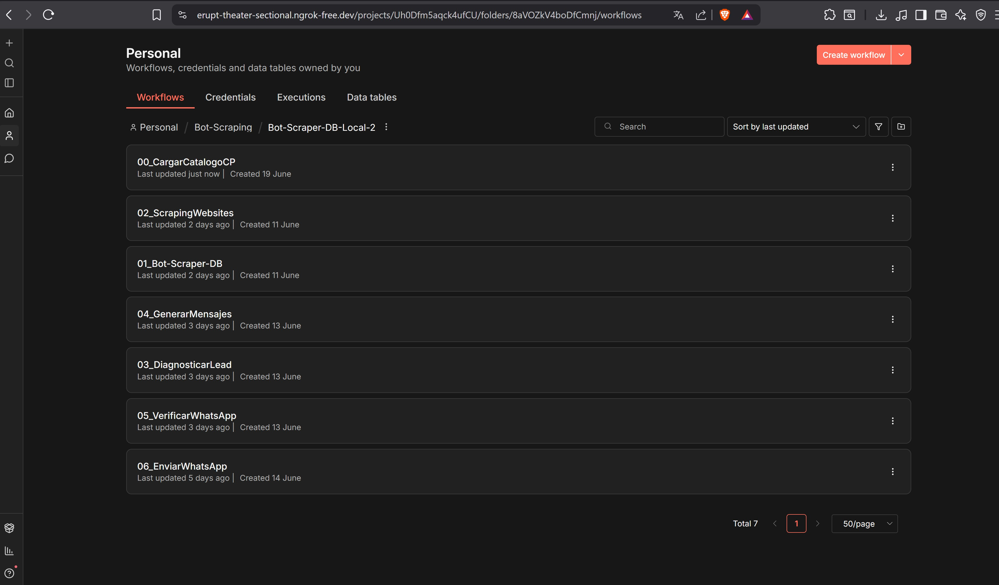
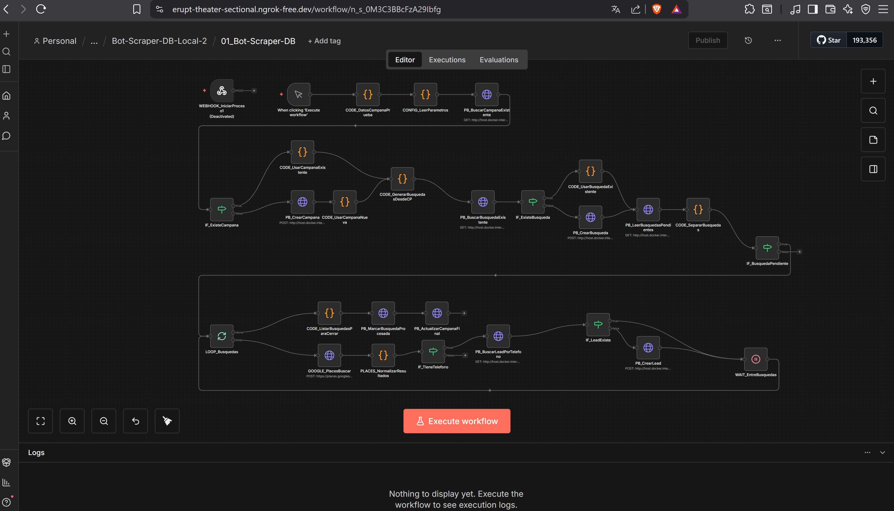
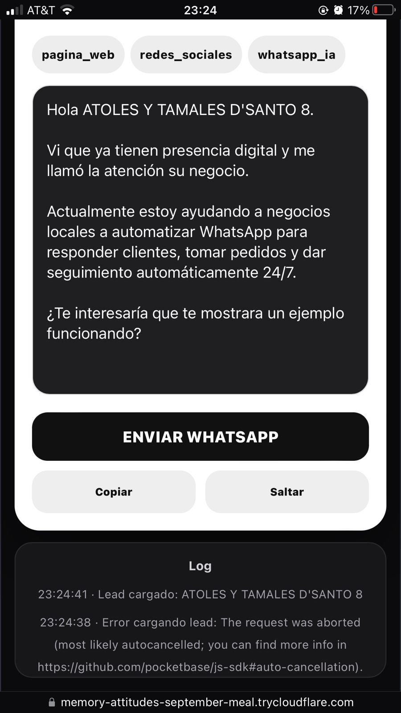
